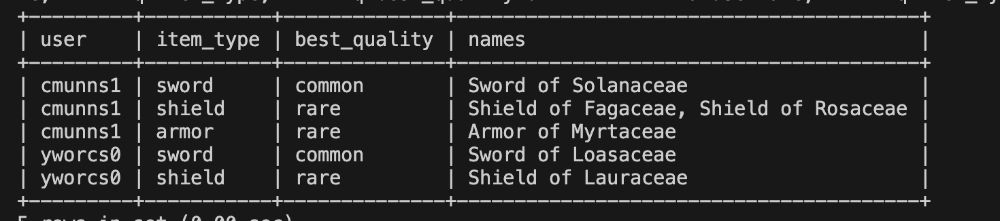

# MMORPG Inventory System

## Project Overview
This project is designed to manage and recommend the best quality items available in the inventory of an MMORPG game. The methodology consists of three primary steps:

1. **Creating the necessary tables** for storing user accounts, items, and their relationships.
2. **Inserting records** into the tables to populate the database with sample data.
3. **Executing an output query** to generate the recommended best quality items for each user based on item type.

---

## Step 1: Creating Tables
To store the necessary data, we create three tables:

### **1. `accounts` Table**
```sql
CREATE TABLE accounts (
    id INT PRIMARY KEY AUTO_INCREMENT,
    username VARCHAR(255) UNIQUE NOT NULL
);
```
This table stores user account details.

### **2. `items` Table**
```sql
CREATE TABLE items (
    id INT PRIMARY KEY AUTO_INCREMENT,  
    type ENUM('sword', 'shield', 'armor') NOT NULL,  
    name VARCHAR(255) NOT NULL  
);
```
This table holds information about different items.

### **3. `accounts_items` Table**
```sql
CREATE TABLE accounts_items (
    account_id INT,
    item_id INT,
    quality ENUM('common', 'rare', 'epic'),
    FOREIGN KEY (account_id) REFERENCES accounts(id),
    FOREIGN KEY (item_id) REFERENCES items(id)
);
```
This table establishes a many-to-many relationship between `accounts` and `items`, while also storing item quality.

---

## Step 2: Inserting Sample Data
We populate the tables with sample records.

### **Insert into `accounts` Table**
```sql
INSERT INTO accounts (id, username) VALUES
(1, 'cmunns1'),
(2, 'yworcs0');
```

### **Insert into `items` Table**
```sql
INSERT INTO items (id, type, name) VALUES
(1, 'sword', 'Sword of Solanaceae'),
(2, 'shield', 'Shield of Rosaceae'),
```

### **Insert into `accounts_items` Table**
```sql
INSERT INTO accounts_items (account_id, item_id, quality) VALUES
(1, 10, 'epic'),
(1, 2, 'rare'),
(1, 2, 'rare'),
```

---

## Step 3: Executing Output Query
To determine the best quality items for each user, we create two **views** and a final **query**:

### **Create View `v1`**
```sql
CREATE VIEW v1 AS
SELECT
    ai.account_id,
    a.username,
    i.type,
    MAX(ai.quality) AS best_quality
FROM
    accounts_items ai
JOIN
    items i ON ai.item_id = i.id
JOIN
    accounts a ON ai.account_id = a.id
GROUP BY
    ai.account_id, a.username, i.type
ORDER BY
    ai.account_id, i.type;
```
This view extracts the best item quality for each user and item type.

### **Create View `v2`**
```sql
CREATE VIEW v2 AS
SELECT
    ai.account_id,
    i.type,
    i.name,
    ai.quality
FROM
    accounts_items ai
JOIN
    items i ON ai.item_id = i.id;
```
This view retrieves item names along with their types and quality.

### **Final Query to Get Advised Items**
```sql
SELECT
    v1.username AS username,
    v1.type AS type,
    v1.best_quality as advised_quality,
    GROUP_CONCAT(DISTINCT v2.name ORDER BY v2.name SEPARATOR ', ') AS advised_names
FROM
    v1
JOIN
    v2 ON
    v1.account_id = v2.account_id AND
    v1.type = v2.type AND
    v1.best_quality = v2.quality
GROUP BY
    v1.username, v1.type, v1.best_quality
ORDER BY
    v1.username, v1.type;
```
This query fetches the best items per user for each type and groups them in a comma-separated list.

---

## Output Example
Here is the expected output of the query:



This output provides:
- The **username** of the player.
- The **item type**.
- The **best quality** available.
- The **recommended item names** in alphabetical order.

---

## Conclusion
This methodology ensures an efficient way to manage user inventories and recommend the best items based on quality in an MMORPG game. By utilizing **database normalization, foreign keys, and views**, the system remains scalable and optimized for future expansions.

